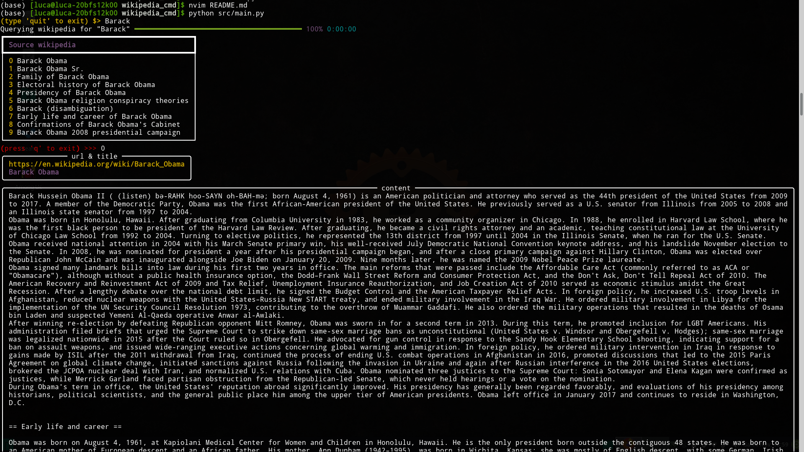

# Wikipedia Cmd
Is a small command line tool to query wikipedia for the first 10 results on a
given subject. It can be used easily from command line to show the contents of
wikipedia queries and do so fast. In order to use it one has to install the
packages rich and wikipedia first.

```
pip install rich
pip install wikipedia
```

## Screenshots


**The selection options:**<br/>



